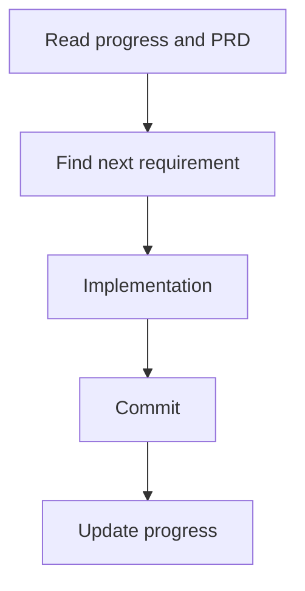
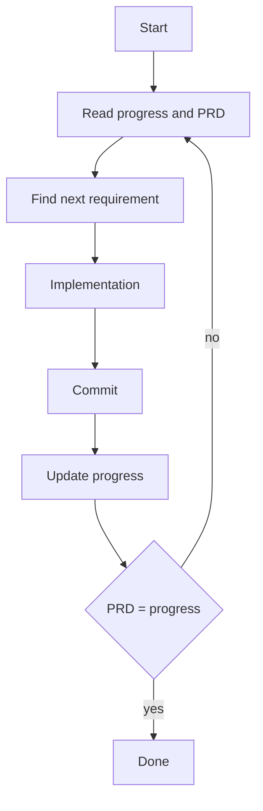

# Ralph Wiggum Approach

*using opencode*

## How To

To get started we require two things:

1. a list of ToDos/Requirements as PRD "Product Requirements Document"
2. a progress tracker

In my very simple approach I chose a markdown file, for documenting the requirements, which I will create with the opencode plan mode. Furthermore progress will be tracked in another simple markdown file.

### 1. HITL - "human in the loop"



run the ralph-once.sh script to go step by step over the requirements. This builds intuition for how the loop works.

```sh
sh ralph-once.sh
```

### 2. Ralph-Loop



run the ralph-loop.sh script with iteration count, which completes if the completion identifier is found.

```sh
sh ralph-loop.sh 20
```

### config

by default, "github-copilot/claude-sonnet-4.5" is configured as model-provider. You can find yours [here](https://models.dev/).
